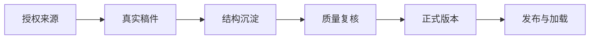

# 依旧沉淀

## 下载桌面端

从 [GitHub Releases](https://github.com/youfei0719/still-settling-workbench/releases/latest) 下载最新版：macOS 选择 Universal DMG，Windows 优先选择 x64 `setup.exe`。

## 自动更新

`0.1.7` 是首个支持自动更新的桌面版本。旧版需要手动安装一次；之后应用会在启动后检查更新，也可在“系统诊断”手动检查。更新包由 Tauri updater 签名校验。未配置 Apple Developer ID、公证或 Windows 证书时，系统可能显示平台安全提示；这不影响 updater 签名校验。

维护者发布下一版：

```bash
npm run release:desktop -- 0.1.8
```

妥善离线备份 updater 私钥；私钥丢失后，已安装应用无法继续验证后续更新。

依旧沉淀是一个本地优先的短视频写作 Skill 工作台。它把经过授权、可验证的视频来源转成真实稿件，提炼可跨题材复用的写法结构，并在人工复核后发布到用户自己选择的 GitHub Skill 仓库或仅保存在本机。

项目不把标题、描述或用户手输文本伪装成“已提取稿件”。无法取得真实内容时，流程会明确停止，而不是继续生成看似可信的结果。

## 适合谁

- 需要把高质量短视频的结构能力沉淀为团队资产的内容运营、编导和内容策略团队。
- 想让 Codex 或其他 Agent 按经过审核的写作结构工作，而不是反复复制提示词的个人创作者。
- 需要把模型连接、来源证据、人审和 GitHub 发布放在同一个本地工作台管理的团队。

## 核心能力

| 能力 | 做什么 | 结果 |
| --- | --- | --- |
| 来源提取 | 接收抖音分享文案或 `v.douyin.com` 短链，优先使用本机浏览器会话提取公开视频 | 视频、音频、关键帧和可分析稿件 |
| 稿件校准 | 可选 FunASR 口播转写和 PaddleOCR 硬字幕识别 | 带来源和质量状态的真实稿件 |
| 结构沉淀 | 拆解钩子、推进、论证、情绪节奏、结尾、适用场景和不可用边界 | 可审核的写作 Skill 草稿 |
| 质量复核 | 记录来源证据、真实模型评测和人工主审结果 | 候选或正式版本，而不是未验证的“万能模板” |
| 写作交付 | 用已审核结构生成可填写的短视频脚本框架，进行风险诊断、版本维护和导出 | 可继续编辑、复核和交付的工作稿 |
| 发布与加载 | 连接已有 GitHub 仓库、由应用创建新仓库，或仅保存在本机 | 版本化 Skill runtime 和动态安装命令 |

## 工作流



正式发布需要满足当前发布门禁：

1. 至少 1 条已授权、可验证的真实稿件。
2. 真实模型发布评测通过且分数不低于 80，确认结构已抽象为可跨题材复用的写法机制。
3. 用户完成最终发布确认，确认适用范围、风险和复用边界。

发布始终由用户手动触发。沉淀、保存或主审不会自动推送到 GitHub。

## 隐私与安全

- 开源仓库默认是空资产库，不包含真实 Skill、稿件、来源、评测报告、诊断记录或媒体文件。
- API Key 和可选抖音 Cookie 只保存到系统钥匙串；系统钥匙串不可用时，它们仅在当前服务进程内保存。
- 设置 API 不回显密钥。环境变量优先于本机设置，适合 Docker、CI 或管理员托管环境。
- GitHub Token 不会由应用保存。应用内创建或发布 GitHub Skill 仓库依赖用户已登录的 `gh` CLI。
- 仅处理你有权访问、使用和沉淀的来源内容。公开链接也可能因地区、作品权限或平台限制而无法下载；此时请停止并补充合法来源，不要绕过访问限制。

## 快速开始

### 前置条件

当前本机启动脚本以 macOS 或 Linux 的 `zsh` 和 `screen` 为基准。Windows 尚未作为受支持的启动环境验证。

- Python 3.14
- Node.js 24 或更新版本
- [uv](https://docs.astral.sh/uv/)
- `screen`
- `ffmpeg`（必需，用于本地媒体处理）
- 可选：`yt-dlp`、FunASR、PaddleOCR、GitHub CLI `gh`

macOS 可先安装基础依赖：

```bash
brew install ffmpeg screen
python3 -m pip install --user yt-dlp
```

### 安装并启动

```bash
git clone https://github.com/youfei0719/still-settling-workbench.git
cd still-settling-workbench

cp .env.example .env
cp .env.workbench.example .env.workbench.local

uv venv .venv --python 3.14
source .venv/bin/activate
uv sync --project backend --active --locked
npm ci

npm run workbench:start
```

打开 <http://127.0.0.1:5173/>。启动脚本会在后台分别运行 API 和前端；可用以下命令查看状态、日志和停止服务：

```bash
npm run workbench:status
npm run workbench:logs
npm run workbench:stop
```

### 手动启动

不使用 `screen` 时，在两个终端分别运行：

```bash
source .venv/bin/activate
python scripts/dev-workbench-api.py
```

```bash
npm run dev --workspace frontend -- --host 127.0.0.1
```

## 首次配置

进入工作台的“系统诊断 -> 首次配置”，按需要完成以下配置。

### 1. 模型连接

填写模型模式、API Base 和 API Key 后，点击“保存并拉取模型”。应用会请求兼容的 `/models` 接口，排除嵌入、音频、图像等非文本模型，并推荐一个适合中文结构化输出的候选模型。你仍可自行选择模型，并通过“测试模型连接”确认真实调用可用。

不使用外部模型时选择 `offline`，应用只使用本地确定性 fallback；需要强制真实模型时选择 `required`。

### 2. Skill 发布项目

选择一种发布方式：

- **连接已有 GitHub 仓库**：粘贴完整的 `https://github.com/owner/repository` 地址，应用会 clone 并校验 remote、分支和本机 Git 状态。
- **创建 GitHub 仓库**：填写名称和可见性。请先在终端完成 `gh auth login`，应用会用当前 GitHub 身份创建仓库并保存本机发布设置。
- **仅本地保存**：创建一个本地 Skill 仓库，不会连接或上传到 GitHub。

通过“验证发布”后，才可在“团队 Codex 同步”中手动发布正式 Skill。安装和更新命令会根据该用户实际配置的仓库地址动态生成。

### 3. 网页媒体转写

生产工作台会在主站临时下载公开媒体、提取音频并调用已配置的托管转写 API。访问者无需安装 Python、yt-dlp、BaoCut 或本机连接器，也无需登录抖音。视频和音频在任务完成或失败后立即删除；长期保留的只有文稿、分析历史和 Skill。详见 [媒体任务部署说明](docs/local-delivery.md)。

## 推荐使用方式

1. 在“沉淀写作 Skill”粘贴完整抖音分享文案或短链。
2. 等待主站媒体任务完成下载、转写和真实稿件准备；失败时确认链接仍公开可访问后重试。
3. 审阅结构拆解，确认它表达的是可迁移的写法能力，而不是逐句仿写来源内容。
4. 工作台自动抽象通用结构、模型评测，并在必要时自动去特定化后复评。
5. 在模型通过后完成一次最终确认，发布 stable Skill 或选择仅本地保存。
6. 团队成员使用生成的安装命令加载最新 stable 版本；未通过门禁的本机 Skill 不会进入稳定 runtime。

## 配置参考

`.env` 只保存通用本地应用配置。`.env.workbench.local` 用于本机工作台能力；两者都被 Git 忽略。

| 场景 | 配置项 |
| --- | --- |
| 模型 | `WORKBENCH_LLM_MODE`、`WORKBENCH_LLM_MODEL`、`WORKBENCH_LLM_API_BASE`、`WORKBENCH_LLM_API_KEY` |
| 数据目录 | `WORKBENCH_DATA_DIR`、`WORKBENCH_DB_MODE` |
| 本机媒体连接器 | `STILL_SETTLING_PROJECT_ROOT`、`STILL_SETTLING_MODEL_PYTHON`、`STILL_SETTLING_YTDLP`、`STILL_SETTLING_FFMPEG` |
| 发布 | `DOUYIN_WRITING_SKILLS_REPO`、`DOUYIN_WRITING_SKILLS_REMOTE_URL`、`DOUYIN_WRITING_SKILLS_BRANCH` |

优先在界面的“首次配置”完成模型和发布设置。环境变量只适合自动化部署、CI 或需要由管理员统一管理配置的场景。

## 常见问题

### 链接识别成功但没有真实稿件

这表示系统已识别出链接，但没有取得足够可靠的视频内容。检查 `yt-dlp` 或下载器配置、公开可访问性、本机浏览器会话，以及 `ffmpeg` 是否可用。系统不会根据标题或描述猜测稿件。

### 为什么不能立刻发布一个 Skill

单个样本的表达仍可能不可迁移，因此工作台会在结构拆解后自动检查题材残留、逐句仿写和过拟合风险，并在必要时自动去特定化后复评。一条已授权真实稿件、模型评测不低于 80 分和最终发布确认共同构成发布门禁；未通过者只能保留在本机，不能进入 stable 包。

### API Key 会上传到 GitHub 吗

不会。界面输入的 API Key 和 Cookie 不写入仓库，也不会在接口响应中回显。请不要手动把真实凭据填入 `.env.example`、截图、Issue 或 Pull Request。

### GitHub 发布被拒绝

确认本机已安装 Git、`gh` 且 `gh auth status` 成功；本地 Skill 仓库必须干净，配置的 remote URL 和本机 `origin` 必须一致，发布分支必须存在。

## 验证与开发

```bash
# 前端类型检查与构建
npm run build --workspace frontend

# 后端单元测试
uv run --project backend pytest backend/unit_tests

# 本机依赖检查
npm run deps:workbench

# 公开发布前的脱敏检查
uv run --project backend python scripts/verify-open-source-release.py
```

贡献前请阅读 [CONTRIBUTING.md](CONTRIBUTING.md)。不要提交真实来源、媒体、Skill 资产、评测报告、API Key、Cookie 或本机路径。

## 项目结构

```text
backend/                 FastAPI API、提取链路、质量门禁和本机设置服务
frontend/                React 工作台
desktop/                 Tauri 桌面客户端；只包含工作台代码与发布加载器模板
scripts/                 本机启动与开源发布检查
evals/workbench/         仅包含可公开的评测配置和提供方代码
.env.example             通用本机配置示例
.env.workbench.example   工作台能力配置示例
```

## 桌面客户端

`desktop/` 是本项目的本地优先 Tauri 客户端。它不会内置或跟踪任何真实 Skill 包；首次发布时，客户端会按用户在系统诊断中配置的目标仓库创建不可变 package 与 stable 清单。

```bash
cd desktop
npm install
npm run tauri:dev
```

桌面端从用户配置的 Skill 仓库读取并校验 `published/stable/manifest.json`、完整 runtime 路径、大小和 SHA-256，不使用 Vite seed 作为事实来源。普通 runtime 发布只会写入 `published/packages/<version>/` 和 `published/stable/manifest.json`；固定加载器只在初始化或用户主动修复时单独提交。真实稿件、媒体、SQLite、Cookie、API Key、诊断日志和构建产物均不进入 Git。

## License

MIT。项目保留 FastAPI Full Stack Template 的上游版权声明，详见 [LICENSE](LICENSE)。
