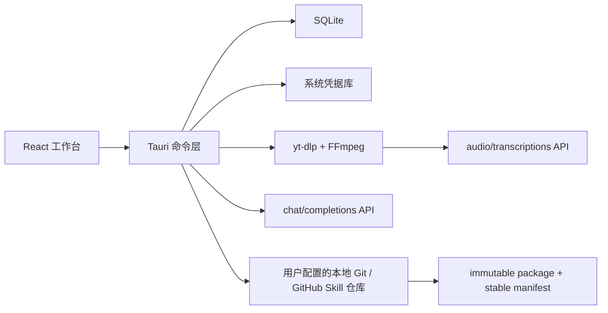

# 依旧沉淀桌面架构

## 发布信息

- 版本：`v0.1.6`
- 发布时间：2026-08-04 CST
- 本次更新：桌面客户端已迁入工作台项目。首次结构拆解直接产出跨题材 Skill；质量检查发现样本题材残留时自动修正并复评，只保留稿件校对确认和最终 stable 发布确认。发布过程会用真实的打包、提交、同步、整合与推送事件驱动进度动画。
- 隐私边界：数据库、真实稿件、临时媒体、Cookie、API Key、代理凭据与运行日志仅保留在本机，已通过 `.gitignore` 排除，不进入仓库、安装包源代码或 stable Skill 包。

## 产品闭环

```text
授权来源 -> 真实稿件 -> AI 校对（人工确认） -> 通用 Skill 抽象与自动评测 -> stable 发布（人工确认）
```

- `沉淀 Skill`：处理抖音链接、本机媒体或经授权的真实稿件。没有真实稿件时立即停止。
- `写作 Skill 库`：每条已授权真实稿件自动独立沉淀为跨题材候选并运行真实模型评测；通过后由用户一次确认发布 stable。
- `系统诊断`：配置模型、转写、抖音会话与发布项目，检查运行依赖和 stable 状态。
- `发布与加载`：生成不可变版本包、逐文件 SHA-256 和 stable 清单，提交到本地 Git；GitHub 模式继续推送。

## 真实运行路径



### 真实稿件

1. 抖音分享文案先提取并校验 `douyin.com` 链接。
2. `yt-dlp` 把媒体下载到应用缓存中的单次任务目录。
3. `FFmpeg` 提取 16kHz 单声道临时 MP3。
4. 已配置的转写 API 返回真实文稿；少于 10 个字视为失败。
5. 无论成功或失败都清理任务缓存；原始本机媒体不会被删除。

`yt-dlp`、`FFmpeg` 或转写密钥缺失时，流程停在“提取真实稿件”，不会用标题或描述替代文稿。

### 结构与评测

- 结构拆解把完整真实稿件发送给用户配置的 OpenAI 兼容模型，并要求 JSON 返回 `name/purpose/hook/progression/ending/riskBoundary`。
- 发布评测把候选结构与其已授权来源证据发送给同一模型，返回分数、通过状态和摘要。
- 评测失败可请求通用化修复：请求只包含候选结构、评测摘要、风险和优点，不包含真实稿件；视频只作为写法样本，结果必须是跨题材的叙事机制而非相邻行业模板。确认应用后保留来源证据，清除旧评测和发布记录，并自动重新评测。
- 模型请求失败、结构化响应无效或分数低于 80 都不会进入最终发布确认。
- 只有两处人工确认：AI 校对稿确认，以及通过模型评测后的最终 stable 发布确认；更新候选内容会清除旧模型评测和旧发布确认。

### 发布

- 只接受 `SKILL.md`、`references/skills.json`、`references/research-playbook.md` 和 `references/skills/*.md`。
- 同一版本目录不可覆盖；内容不同会被拒绝。
- stable 清单包含每个运行时文件的路径、字节数和 SHA-256。
- React 只提交候选 ID 与最终确认；Rust 从 SQLite 读取候选，先读取并校验用户配置仓库的当前 stable runtime，再按候选 ID 增量替换或新增 Skill，保留其余 Skill。
- runtime 发布只暂存 `published/packages/<version>/` 和 `published/stable/manifest.json`，不会 `git add .`，也不会静默更新根目录加载器；加载器初始化、修复和升级是独立操作。
- GitHub 模式在构建前检查工作区、执行 `git fetch --prune` 与 `merge --ff-only <remote>/<branch>`，再执行 `git push <remote> HEAD:<branch>`。
- 推送后必须验证 `ls-remote` 与本地 commit 一致；公开仓库再按精确 commit SHA 检查 GitHub Raw manifest 和所有 runtime 哈希，所有模式都会用带凭据的干净 clone 校验 manifest、完整 runtime 和实际 loader。推送或整合失败时本地提交仍保留，可重试同一发布任务和版本。

## 本机数据与凭据

| 数据 | 存储 |
| --- | --- |
| 来源、稿件、候选、事件、评测、最终确认、发布任务和发布记录 | SQLite |
| 文本模型 Key、转写 Key、可选抖音 Cookie | Keychain / Credential Manager |
| 原始本机媒体 | 用户原路径，只读 |
| 临时下载与音频 | 应用缓存，任务结束清理 |
| 正式 Skill | 用户配置的 Git 仓库 |

浏览器开发预览只用于检查界面和响应式布局：不保存工作台状态，不调用原生命令，也不使用 localStorage 模拟发布结果。

## 跨平台依赖

- macOS：`yt-dlp`、`ffmpeg`、`git`；GitHub 同步另需 `gh`。
- Windows：同名命令或 `.exe` 位于 `PATH`、WinGet Links、Program Files、Chocolatey 或 Scoop 常见目录；GitHub 同步另需 GitHub CLI。
- 文本 API 必须兼容 `POST /chat/completions`；转写 API 必须兼容 `POST /audio/transcriptions`。

桌面安装包本身不捆绑第三方媒体二进制。系统诊断会从 `PATH` 与平台常见安装目录解析绝对路径，再读取各命令的真实版本并明确指出缺失项；macOS GUI 不需要继承 Homebrew 的 shell PATH。

## 验证

```bash
cd desktop
npm run build
npm run test:unit
cargo test --manifest-path src-tauri/Cargo.toml
npm run test

cd ..
python3 -m unittest discover -s tests -v
python3 scripts/build_stable_manifest.py --check
```
